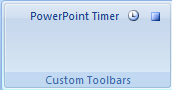

# pptimer #

PowerPoint timer -- Jason Sachs <jmsachs@gmail.com> aka `jason-s`

This PowerPoint module adds a custom toolbar in the Add-Ins section with two buttons,
one to enable timing slideshows and the other to disable timing slideshows.



It will produce a file called pptimer.txt in your `{APPDATA}/Roaming` folder,
and will just append lines to this file that look like this:

```
Starting presentation pptimer.pptm at 5/18/2016 4:00:22 PM
000000 #001 pptimer.pptm
000004 #002 pptimer.pptm
000006 #003 pptimer.pptm
000008 #004 pptimer.pptm
000011 #003 pptimer.pptm
000015 #002 pptimer.pptm
000015 #003 pptimer.pptm
000015 #004 pptimer.pptm
000017 #003 pptimer.pptm
000020 #004 pptimer.pptm
Ending presentation pptimer.pptm at 5/18/2016 4:00:44 PM; elapsed time = 22
```

Very simple -- at each transition between slides it will add a line containing:

- elapsed time (seconds, 6 digits)
- slide number (#xxx)
- the name of the PowerPoint presentation

## To install ##

- Copy pptimer.ppam to `{APPDATA}\Roaming\Microsoft\AddIns`
- Open PowerPoint
- Press the office button in the upper left
- Go to PowerPoint Options -> Add-Ins -> PowerPoint Add-ins -> Go...
- Click Add New... and select pptimer.ppam

## Limitations ##

Not sure. It works with Office 2007, you're on your own if it doesn't work.

This is VBA!!! Yeccchhh! But it was vaguely easy to do this. I don't really know VBA so I'm surprised it wasn't more difficult. I probably made mistakes. Oh well.

## License ##

Copyright 2016 Jason M. Sachs

Licensed under the Apache License, Version 2.0 (the "License");
you may not use this file except in compliance with the License.
You may obtain a copy of the License at

    http://www.apache.org/licenses/LICENSE-2.0

Unless required by applicable law or agreed to in writing, software
distributed under the License is distributed on an "AS IS" BASIS,
WITHOUT WARRANTIES OR CONDITIONS OF ANY KIND, either express or implied.
See the License for the specific language governing permissions and
limitations under the License.